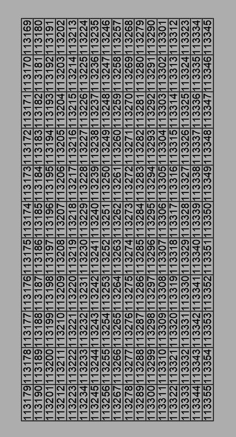

This program can create a table in dxf format with special numbers. Needed for the door making machine.

Basic interface

Just enter file name and start number and generate your dxf file.

Basically file has 17 columns and 11 rows.

